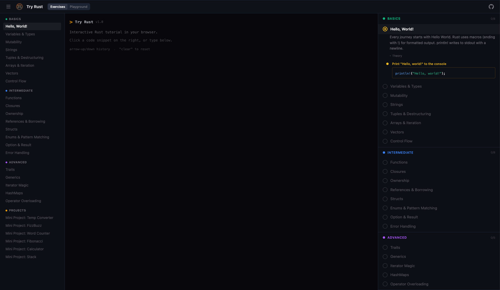

# tryrust.org


Welcome to the interactive tutorial project, [tryrust.org](https://tryrust.org), which runs directly in your browser.



> **Note:** We continuously update the number of tutorials. It is still in progress.

## Tech Stack

- **Frontend & Backend:** [Dioxus](https://dioxuslabs.com) 0.7 (fullstack, Rust + WASM)
- **Styling:** [Tailwind CSS](https://tailwindcss.com) v4
- **Package Manager:** Yarn
- **Rust Edition:** 2024

## Running the project

Install dependencies:

```bash
yarn install
cargo install dioxus-cli
```

Run the dev server (Tailwind CSS is automatically handled by `dx` via `asset!()`):

```bash
dx serve
```

## Compiling for Release

```bash
dx build --release --platform fullstack
```

## Docker

Build and run the Docker image:

```bash
docker build . -t tryrust
docker run -p 8080:8080 tryrust
```

## Inspiration

The site was inspired by [tryclojure.org](https://tryclojure.org) and [tryhaskell.org](https://tryhaskell.org).
