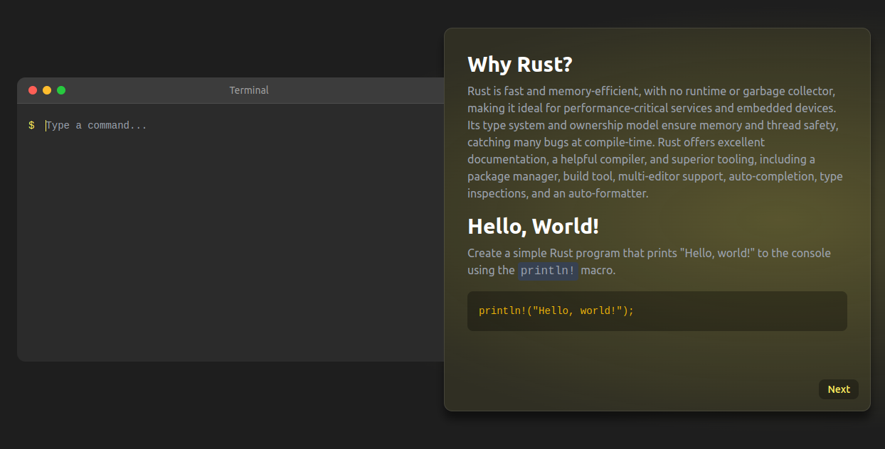

# tryrust.org

Welcome to the interactive tutorial project, [tryrust.org](https://tryrust.org), which runs directly in your browser.



> **Note:** We continuously update the number of tutorials. It is still in progress.

If you want to run it locally, execute the commands below.

## Running the project

To get started with running the project locally, you will need to execute the following commands. These commands will help you compile your stylesheets and watch for changes in the project.


First, compile the CSS using TailwindCSS:

```bash
npx tailwindcss -i input.css -o ./style/output.css --watch
```

Next, run the Leptos development server to watch changes and automatically reload:

```bash
cargo leptos watch
```

## Compiling for Release
```bash
cargo leptos build --release
```

Will generate your server binary in target/server/release and the site package in target/site

## Docker

For containerizing the application, build the Docker image with the following command:

```bash
docker build . -t tryrust
```

Once the image is built, run it with:


```bash
docker run -p8080:8080 tryrust 
```

## Inspiration
The site was inspired by [tryclojure.org](https://tryclojure.org) and [tryhaskell.org](https://tryhaskell.org).